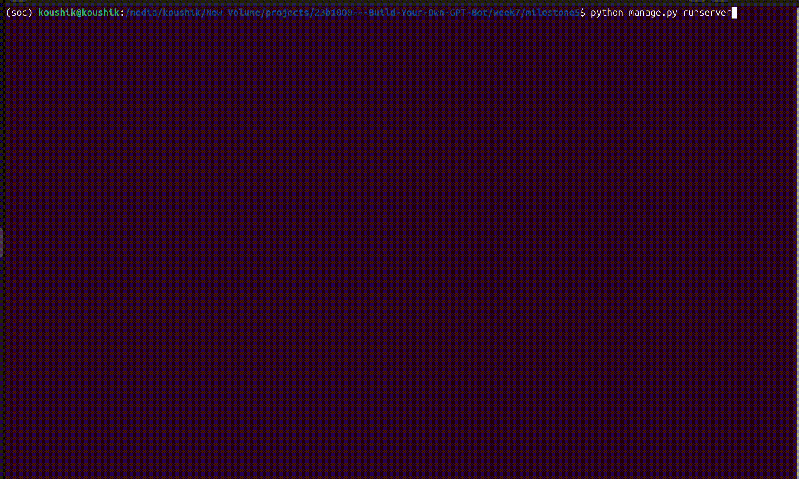

#  Week 7 — IITB UG Rule Assistance Bot

This week focused on learning **Retrieval-Augmented Generation (RAG)** and implementing it to build a practical academic chatbot for IIT Bombay students.

---

## **Milestone 5: IITB UG Rule Assistance Bot**

**Goal:**  
Create a chatbot that answers queries about **IIT Bombay’s UG academic rules** using **Gemini + RAG**.

**What it does:**  
- Uses **RAG** to fetch relevant sections from the UG rulebook and circulars.
- Uses the **Gemini API** to generate **clear, student-friendly responses**.
- Deployed and hosted using **Django**.

---

## What I accomplished this week

###  1. Learned about Retrieval-Augmented Generation (RAG)
- Studied how RAG combines information retrieval with generative AI.
- Explored ways to embed, index, and search rulebook content.

### 2. Implemented a basic RAG pipeline
- Built a local Python RAG setup to retrieve text chunks from the rulebook.
- Integrated it with Gemini to produce grounded responses.
- [ **View folder**: `week7/milestone5/rag`](./milestone5/rag)

### 3. Hosted the chatbot using Django
- Created a Django app that connects to Gemini.
- Set up routes and templates for the chat interface.
- Deployed a working version that answers questions about UG academic rules.
- [**View folder**: `week7/milestone5`](./milestone5)

---

## **Website Preview**

Here’s a demo of the deployed chatbot in action:

---
